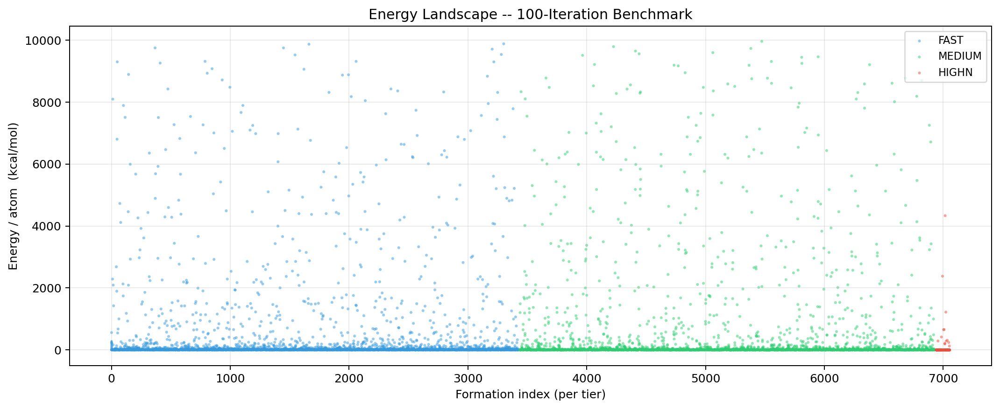
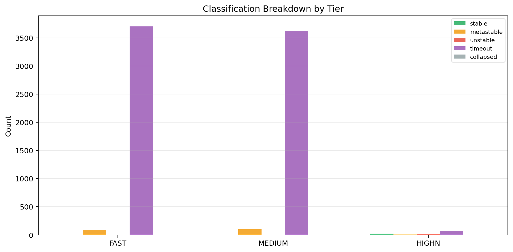
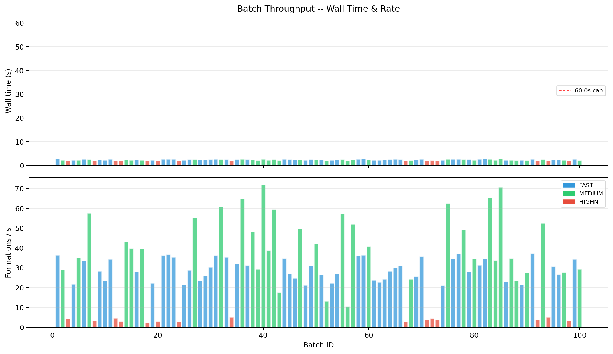
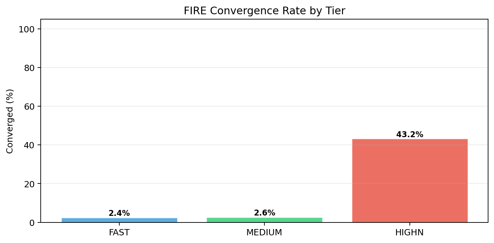

# 100-Iteration Benchmark -- Summary

**Generated:** 2026-03-28 12:56:31  
**Total iterations:** 100  
**Total formations:** 7639  
**Total wall time:** 244.5 s  (4.1 min)  

## Per-Tier Overview

| Tier | Batches | Formations | Stable | Meta | Best E/atom | Median E/atom | Avg ms/form |
|---|---:|---:|---:|---:|---:|---:|---:|
| FAST | 50 | 3795 | 0 | 91 | -0.0527 | +10.4198 | 0.50 |
| MEDIUM | 35 | 3726 | 0 | 98 | -0.0356 | +5.7198 | 0.98 |
| HIGHN | 15 | 118 | 25 | 6 | -0.3219 | -0.0171 | 7.10 |
| **ALL** | **100** | **7639** | **25** | **195** | **-0.3219** | **+7.5689** | -- |

## Classification Totals

| Class | Count | Share |
|---|---:|---:|
| stable | 25 | 0.3% |
| metastable | 195 | 2.6% |
| unstable | 20 | 0.3% |
| timeout | 7399 | 96.9% |
| collapsed | 0 | 0.0% |
| fragment | 0 | 0.0% |
| **total** | **7639** | 100% |

## Top 10 Formations (Lowest E/atom)

| Rank | Formula | E/atom (kcal/mol) | Class | Tier (steps) | ms |
|---:|---|---:|---|---|---:|
| 1 | `Ca2SiO4` | -0.3219 | stable | highn / 10000 | 2.9 |
| 2 | `C14H10` | -0.2995 | timeout | highn / 10000 | 27.1 |
| 3 | `C10H8` | -0.2716 | unstable | highn / 10000 | 15.8 |
| 4 | `C10H22` | -0.2376 | timeout | highn / 10000 | 56.3 |
| 5 | `C6H4(COOH)2` | -0.2353 | unstable | highn / 10000 | 7.6 |
| 6 | `C10H22` | -0.2328 | timeout | highn / 10000 | 50.3 |
| 7 | `C12H26` | -0.2298 | timeout | highn / 10000 | 66.9 |
| 8 | `C6H10O` | -0.2292 | metastable | highn / 10000 | 12.0 |
| 9 | `C8H18` | -0.2282 | timeout | highn / 10000 | 32.4 |
| 10 | `C6H12O6` | -0.2226 | timeout | highn / 10000 | 29.9 |

## Batch Timing Log

| Batch | Mode | Steps | Formulas | Results | Wall (s) | Rate (f/s) | Best E/atom |
|---:|---|---:|---:|---:|---:|---:|---:|
| 001 | FAST | 50 | 101 | 101 | 2.78 | 36.37 | -0.0268 |
| 002 | MEDIUM | 1000 | 33 | 66 | 2.28 | 28.96 | +0.0000 |
| 003 | HIGHN | 10000 | 9 | 9 | 2.09 | 4.31 | -0.1810 |
| 004 | FAST | 50 | 52 | 52 | 2.40 | 21.71 | -0.0108 |
| 005 | MEDIUM | 1000 | 41 | 82 | 2.35 | 34.93 | +0.0000 |
| 006 | FAST | 50 | 89 | 89 | 2.66 | 33.51 | +0.0000 |
| 007 | MEDIUM | 1000 | 74 | 148 | 2.57 | 57.53 | -0.0321 |
| 008 | HIGHN | 10000 | 7 | 7 | 2.08 | 3.37 | -0.2353 |
| 009 | FAST | 50 | 71 | 71 | 2.51 | 28.29 | +0.0000 |
| 010 | FAST | 50 | 56 | 56 | 2.39 | 23.39 | -0.0251 |
| 011 | FAST | 50 | 93 | 93 | 2.70 | 34.45 | -0.0527 |
| 012 | HIGHN | 10000 | 10 | 10 | 2.15 | 4.66 | -0.2282 |
| 013 | HIGHN | 10000 | 6 | 6 | 2.06 | 2.91 | -0.1810 |
| 014 | MEDIUM | 1000 | 52 | 104 | 2.41 | 43.16 | -0.0331 |
| 015 | MEDIUM | 1000 | 47 | 94 | 2.36 | 39.77 | -0.0246 |
| 016 | FAST | 50 | 70 | 70 | 2.50 | 27.99 | -0.0215 |
| 017 | MEDIUM | 1000 | 47 | 94 | 2.38 | 39.58 | +0.0000 |
| 018 | HIGHN | 10000 | 5 | 5 | 2.05 | 2.44 | -0.0480 |
| 019 | FAST | 50 | 53 | 53 | 2.38 | 22.27 | -0.0263 |
| 020 | HIGHN | 10000 | 6 | 6 | 2.06 | 2.91 | -0.0331 |
| 021 | FAST | 50 | 100 | 100 | 2.75 | 36.32 | +0.0000 |
| 022 | FAST | 50 | 101 | 101 | 2.75 | 36.78 | -0.0269 |
| 023 | FAST | 50 | 95 | 95 | 2.68 | 35.49 | +0.0000 |
| 024 | HIGHN | 10000 | 6 | 6 | 2.10 | 2.86 | -0.1845 |
| 025 | FAST | 50 | 51 | 51 | 2.37 | 21.49 | +0.0880 |
| 026 | FAST | 50 | 75 | 75 | 2.60 | 28.81 | +0.0000 |
| 027 | MEDIUM | 1000 | 71 | 142 | 2.58 | 55.13 | -0.0270 |
| 028 | FAST | 50 | 57 | 57 | 2.44 | 23.39 | +0.0000 |
| 029 | FAST | 50 | 65 | 65 | 2.50 | 26.01 | +0.0000 |
| 030 | FAST | 50 | 77 | 77 | 2.53 | 30.40 | -0.0030 |
| 031 | FAST | 50 | 96 | 96 | 2.64 | 36.31 | +0.0000 |
| 032 | MEDIUM | 1000 | 80 | 160 | 2.63 | 60.73 | -0.0277 |
| 033 | FAST | 50 | 92 | 92 | 2.60 | 35.40 | +0.0000 |
| 034 | HIGHN | 10000 | 11 | 11 | 2.12 | 5.19 | -0.3219 |
| 035 | FAST | 50 | 82 | 82 | 2.55 | 32.18 | +0.0000 |
| 036 | MEDIUM | 1000 | 87 | 174 | 2.69 | 64.66 | -0.0265 |
| 037 | FAST | 50 | 81 | 81 | 2.60 | 31.21 | -0.0225 |
| 038 | MEDIUM | 1000 | 60 | 120 | 2.49 | 48.26 | -0.0340 |
| 039 | MEDIUM | 1000 | 33 | 66 | 2.25 | 29.39 | -0.0275 |
| 040 | MEDIUM | 1000 | 99 | 198 | 2.76 | 71.85 | -0.0230 |
| 041 | MEDIUM | 1000 | 46 | 92 | 2.38 | 38.68 | -0.0274 |
| 042 | MEDIUM | 1000 | 77 | 154 | 2.59 | 59.35 | -0.0321 |
| 043 | MEDIUM | 1000 | 19 | 38 | 2.16 | 17.57 | +0.1024 |
| 044 | FAST | 50 | 95 | 95 | 2.74 | 34.66 | -0.0172 |
| 045 | FAST | 50 | 68 | 68 | 2.52 | 26.96 | +0.0000 |
| 046 | FAST | 50 | 60 | 60 | 2.43 | 24.71 | +0.0000 |
| 047 | MEDIUM | 1000 | 62 | 124 | 2.50 | 49.65 | -0.0356 |
| 048 | FAST | 50 | 50 | 50 | 2.36 | 21.23 | +0.0000 |
| 049 | FAST | 50 | 81 | 81 | 2.60 | 31.15 | +0.0000 |
| 050 | MEDIUM | 1000 | 51 | 102 | 2.43 | 42.05 | +0.0000 |
| 051 | FAST | 50 | 66 | 66 | 2.50 | 26.45 | +0.0000 |
| 052 | MEDIUM | 1000 | 14 | 28 | 2.12 | 13.20 | +0.0114 |
| 053 | FAST | 50 | 52 | 52 | 2.34 | 22.24 | +0.0000 |
| 054 | FAST | 50 | 68 | 68 | 2.51 | 27.04 | +0.0000 |
| 055 | MEDIUM | 1000 | 75 | 150 | 2.62 | 57.18 | -0.0277 |
| 056 | MEDIUM | 1000 | 11 | 22 | 2.09 | 10.53 | +0.0000 |
| 057 | MEDIUM | 1000 | 65 | 130 | 2.50 | 51.96 | -0.0265 |
| 058 | FAST | 50 | 97 | 97 | 2.69 | 36.00 | +0.0000 |
| 059 | FAST | 50 | 101 | 101 | 2.77 | 36.50 | +0.0000 |
| 060 | MEDIUM | 1000 | 49 | 98 | 2.41 | 40.73 | -0.0292 |
| 061 | FAST | 50 | 57 | 57 | 2.40 | 23.77 | -0.0262 |
| 062 | FAST | 50 | 54 | 54 | 2.37 | 22.75 | +0.0466 |
| 063 | FAST | 50 | 60 | 60 | 2.47 | 24.33 | +0.0000 |
| 064 | FAST | 50 | 74 | 74 | 2.61 | 28.35 | -0.0239 |
| 065 | FAST | 50 | 80 | 80 | 2.67 | 29.91 | +0.0000 |
| 066 | FAST | 50 | 81 | 81 | 2.60 | 31.16 | -0.0117 |
| 067 | HIGHN | 10000 | 6 | 6 | 2.12 | 2.84 | -0.2127 |
| 068 | MEDIUM | 1000 | 27 | 54 | 2.22 | 24.36 | +0.0296 |
| 069 | FAST | 50 | 63 | 63 | 2.46 | 25.60 | -0.0225 |
| 070 | FAST | 50 | 96 | 96 | 2.69 | 35.70 | +0.0000 |
| 071 | HIGHN | 10000 | 8 | 8 | 2.08 | 3.84 | -0.1882 |
| 072 | HIGHN | 10000 | 10 | 10 | 2.21 | 4.53 | -0.2995 |
| 073 | HIGHN | 10000 | 8 | 8 | 2.12 | 3.78 | -0.2328 |
| 074 | FAST | 50 | 50 | 50 | 2.36 | 21.14 | +0.0000 |
| 075 | MEDIUM | 1000 | 84 | 168 | 2.69 | 62.35 | -0.0259 |
| 076 | FAST | 50 | 94 | 94 | 2.72 | 34.57 | -0.0215 |
| 077 | FAST | 50 | 99 | 99 | 2.67 | 37.07 | +0.0000 |
| 078 | MEDIUM | 1000 | 63 | 126 | 2.55 | 49.32 | -0.0103 |
| 079 | FAST | 50 | 72 | 72 | 2.58 | 27.86 | +0.0000 |
| 080 | MEDIUM | 1000 | 40 | 80 | 2.31 | 34.59 | +0.0000 |
| 081 | FAST | 50 | 83 | 83 | 2.64 | 31.39 | -0.0262 |
| 082 | FAST | 50 | 97 | 97 | 2.81 | 34.55 | -0.0269 |
| 083 | MEDIUM | 1000 | 88 | 176 | 2.69 | 65.32 | -0.0283 |
| 084 | MEDIUM | 1000 | 39 | 78 | 2.31 | 33.72 | -0.0292 |
| 085 | MEDIUM | 1000 | 100 | 200 | 2.83 | 70.68 | -0.0293 |
| 086 | FAST | 50 | 54 | 54 | 2.36 | 22.85 | -0.0244 |
| 087 | MEDIUM | 1000 | 40 | 80 | 2.31 | 34.67 | +0.0000 |
| 088 | MEDIUM | 1000 | 26 | 52 | 2.22 | 23.43 | +0.1090 |
| 089 | FAST | 50 | 50 | 50 | 2.34 | 21.41 | -0.0117 |
| 090 | MEDIUM | 1000 | 31 | 62 | 2.26 | 27.43 | +0.0000 |
| 091 | FAST | 50 | 100 | 100 | 2.68 | 37.29 | -0.0263 |
| 092 | HIGHN | 10000 | 8 | 8 | 2.11 | 3.79 | -0.2292 |
| 093 | MEDIUM | 1000 | 67 | 134 | 2.55 | 52.55 | -0.0230 |
| 094 | HIGHN | 10000 | 11 | 11 | 2.15 | 5.11 | -0.2376 |
| 095 | FAST | 50 | 77 | 77 | 2.51 | 30.67 | +0.0000 |
| 096 | FAST | 50 | 65 | 65 | 2.45 | 26.55 | -0.0074 |
| 097 | MEDIUM | 1000 | 32 | 64 | 2.31 | 27.69 | +0.0000 |
| 098 | HIGHN | 10000 | 7 | 7 | 2.08 | 3.37 | -0.2716 |
| 099 | FAST | 50 | 94 | 94 | 2.74 | 34.35 | +0.0000 |
| 100 | MEDIUM | 1000 | 33 | 66 | 2.24 | 29.40 | +0.0000 |

## Charts

