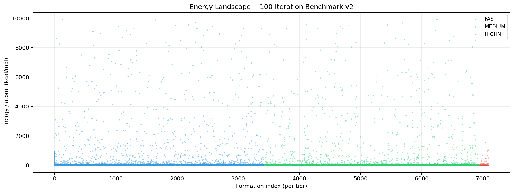
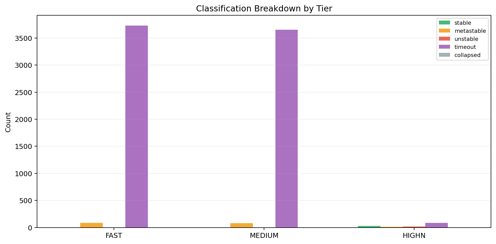
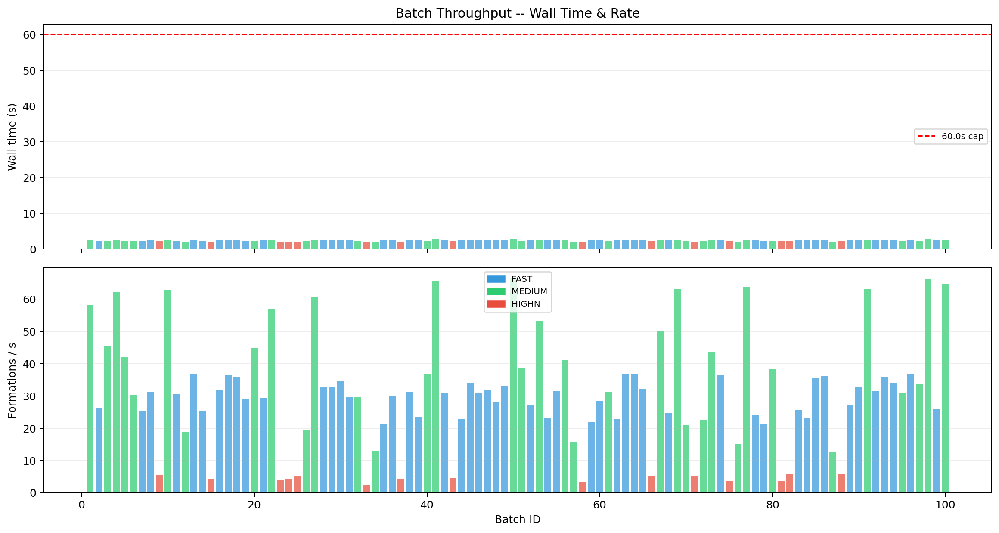
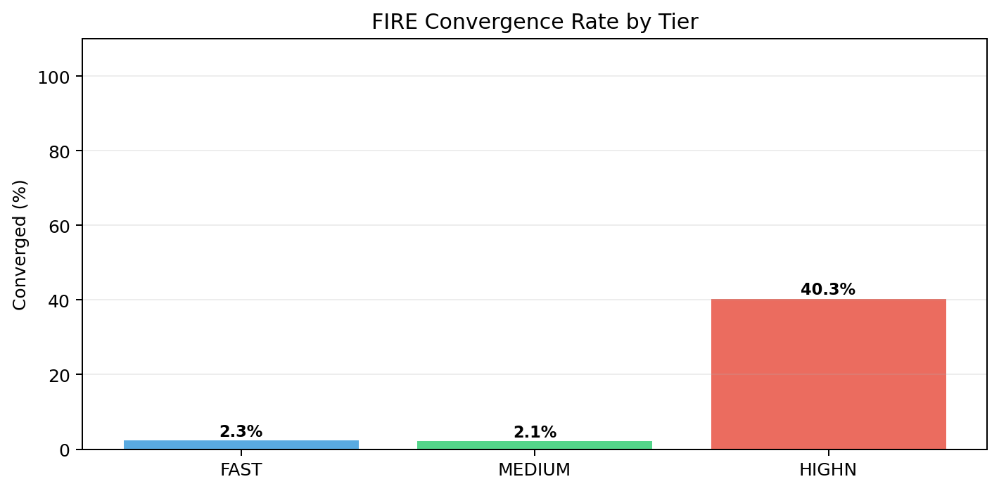
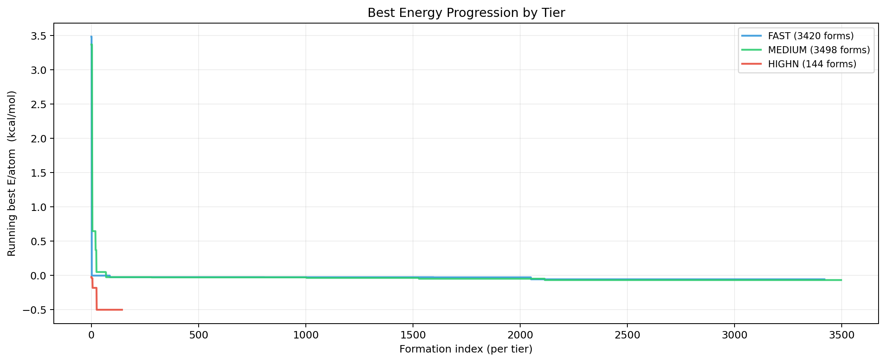
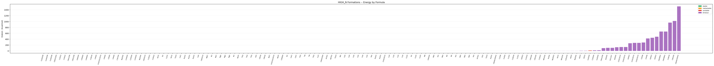

# 100-Iteration Benchmark v2 -- Summary

**Generated:** 2026-03-28 13:07:42  
**Total iterations:** 100  
**Total formations:** 7694  
**Total wall time:** 244.0 s  (4.1 min)  

## Per-Tier Overview

| Tier | Batches | Formations | Stable | Meta | Best E/atom | Median E/atom | Avg ms/form |
|---|---:|---:|---:|---:|---:|---:|---:|
| FAST | 50 | 3820 | 0 | 87 | -0.0563 | +10.9312 | 0.50 |
| MEDIUM | 35 | 3730 | 0 | 78 | -0.0670 | +4.8228 | 1.02 |
| HIGHN | 15 | 144 | 27 | 13 | -0.5001 | -0.0145 | 9.01 |
| **ALL** | **100** | **7694** | **27** | **178** | **-0.5001** | **+7.1033** | -- |

## Classification Totals

| Class | Count | Share |
|---|---:|---:|
| stable | 27 | 0.4% |
| metastable | 178 | 2.3% |
| unstable | 19 | 0.2% |
| timeout | 7470 | 97.1% |
| collapsed | 0 | 0.0% |
| fragment | 0 | 0.0% |
| **total** | **7694** | 100% |

## Top 10 Formations (Lowest E/atom)

| Rank | Formula | E/atom (kcal/mol) | Class | Tier/Steps | ms |
|---:|---|---:|---|---|---:|
| 1 | `Ca3Al2O6` | -0.5001 | metastable | highn/10000 | 5.2 |
| 2 | `Ca3Al2O6` | -0.5001 | metastable | highn/10000 | 5.1 |
| 3 | `Ca3Al2O6` | -0.4875 | timeout | highn/10000 | 6.7 |
| 4 | `C6H5COOH` | -0.2387 | stable | highn/10000 | 11.1 |
| 5 | `C10H22` | -0.2383 | timeout | highn/10000 | 50.6 |
| 6 | `C10H22` | -0.2383 | timeout | highn/10000 | 49.4 |
| 7 | `C6H12O6` | -0.2342 | timeout | highn/10000 | 28.2 |
| 8 | `C6H12O6` | -0.2324 | timeout | highn/10000 | 28.9 |
| 9 | `C6H5OH` | -0.2095 | timeout | highn/10000 | 8.7 |
| 10 | `C4H9OH` | -0.2022 | stable | highn/10000 | 8.6 |

## Batch Timing Log

| Batch | Mode | Steps | Formulas | Results | Wall (s) | Rate (f/s) | Best E/atom |
|---:|---|---:|---:|---:|---:|---:|---:|
| 001 | MEDIUM | 1000 | 75 | 150 | 2.58 | 58.25 | -0.0253 |
| 002 | FAST | 50 | 61 | 61 | 2.33 | 26.16 | -0.0022 |
| 003 | MEDIUM | 1000 | 54 | 108 | 2.37 | 45.53 | -0.0230 |
| 004 | MEDIUM | 1000 | 78 | 156 | 2.51 | 62.12 | -0.0278 |
| 005 | MEDIUM | 1000 | 49 | 98 | 2.34 | 41.97 | -0.0253 |
| 006 | MEDIUM | 1000 | 34 | 68 | 2.24 | 30.40 | +0.0255 |
| 007 | FAST | 50 | 58 | 58 | 2.30 | 25.24 | -0.0247 |
| 008 | FAST | 50 | 76 | 76 | 2.43 | 31.25 | +0.0000 |
| 009 | HIGHN | 10000 | 12 | 12 | 2.17 | 5.53 | -0.1809 |
| 010 | MEDIUM | 1000 | 80 | 160 | 2.55 | 62.72 | -0.0279 |
| 011 | FAST | 50 | 73 | 73 | 2.39 | 30.60 | +0.0000 |
| 012 | MEDIUM | 1000 | 20 | 40 | 2.13 | 18.74 | +0.3257 |
| 013 | FAST | 50 | 92 | 92 | 2.49 | 36.90 | -0.0224 |
| 014 | FAST | 50 | 59 | 59 | 2.33 | 25.36 | +0.2328 |
| 015 | HIGHN | 10000 | 9 | 9 | 2.07 | 4.34 | -0.1615 |
| 016 | FAST | 50 | 78 | 78 | 2.44 | 32.03 | +0.0000 |
| 017 | FAST | 50 | 91 | 91 | 2.50 | 36.33 | +0.0000 |
| 018 | FAST | 50 | 87 | 87 | 2.41 | 36.04 | -0.0167 |
| 019 | FAST | 50 | 69 | 69 | 2.39 | 28.86 | +0.0000 |
| 020 | MEDIUM | 1000 | 53 | 106 | 2.37 | 44.80 | -0.0172 |
| 021 | FAST | 50 | 71 | 71 | 2.41 | 29.48 | +0.0000 |
| 022 | MEDIUM | 1000 | 71 | 142 | 2.49 | 57.01 | -0.0280 |
| 023 | HIGHN | 10000 | 8 | 8 | 2.11 | 3.79 | -0.5001 |
| 024 | HIGHN | 10000 | 9 | 9 | 2.08 | 4.34 | -0.2095 |
| 025 | HIGHN | 10000 | 11 | 11 | 2.08 | 5.29 | -0.5001 |
| 026 | MEDIUM | 1000 | 21 | 42 | 2.16 | 19.44 | +0.0000 |
| 027 | MEDIUM | 1000 | 82 | 164 | 2.71 | 60.53 | -0.0356 |
| 028 | FAST | 50 | 86 | 86 | 2.62 | 32.85 | -0.0238 |
| 029 | FAST | 50 | 87 | 87 | 2.67 | 32.60 | -0.0256 |
| 030 | FAST | 50 | 95 | 95 | 2.75 | 34.50 | +0.0000 |
| 031 | FAST | 50 | 77 | 77 | 2.60 | 29.60 | +0.0000 |
| 032 | MEDIUM | 1000 | 34 | 68 | 2.30 | 29.60 | -0.0270 |
| 033 | HIGHN | 10000 | 5 | 5 | 2.05 | 2.44 | -0.1882 |
| 034 | MEDIUM | 1000 | 14 | 28 | 2.16 | 12.98 | +0.0983 |
| 035 | FAST | 50 | 52 | 52 | 2.43 | 21.42 | +0.0000 |
| 036 | FAST | 50 | 79 | 79 | 2.63 | 30.00 | -0.0165 |
| 037 | HIGHN | 10000 | 9 | 9 | 2.09 | 4.31 | -0.0597 |
| 038 | FAST | 50 | 84 | 84 | 2.69 | 31.23 | -0.0157 |
| 039 | FAST | 50 | 58 | 58 | 2.46 | 23.62 | +0.0000 |
| 040 | MEDIUM | 1000 | 44 | 88 | 2.39 | 36.78 | +0.0360 |
| 041 | MEDIUM | 1000 | 91 | 182 | 2.78 | 65.46 | -0.0266 |
| 042 | FAST | 50 | 81 | 81 | 2.62 | 30.90 | +0.0000 |
| 043 | HIGHN | 10000 | 10 | 10 | 2.25 | 4.45 | -0.1988 |
| 044 | FAST | 50 | 56 | 56 | 2.44 | 22.96 | -0.0251 |
| 045 | FAST | 50 | 93 | 93 | 2.73 | 34.05 | -0.0034 |
| 046 | FAST | 50 | 80 | 80 | 2.60 | 30.77 | +0.0000 |
| 047 | FAST | 50 | 82 | 82 | 2.59 | 31.66 | -0.0276 |
| 048 | FAST | 50 | 72 | 72 | 2.55 | 28.24 | +0.0000 |
| 049 | FAST | 50 | 88 | 88 | 2.67 | 33.02 | +0.0000 |
| 050 | MEDIUM | 1000 | 94 | 188 | 2.83 | 66.50 | -0.0476 |
| 051 | MEDIUM | 1000 | 46 | 92 | 2.38 | 38.58 | -0.0052 |
| 052 | FAST | 50 | 69 | 69 | 2.52 | 27.36 | +0.0000 |
| 053 | MEDIUM | 1000 | 69 | 138 | 2.59 | 53.21 | -0.0349 |
| 054 | FAST | 50 | 57 | 57 | 2.48 | 22.98 | +0.0452 |
| 055 | FAST | 50 | 86 | 86 | 2.72 | 31.63 | +0.0199 |
| 056 | MEDIUM | 1000 | 51 | 102 | 2.48 | 41.07 | +0.0000 |
| 057 | MEDIUM | 1000 | 17 | 34 | 2.16 | 15.76 | -0.0268 |
| 058 | HIGHN | 10000 | 7 | 7 | 2.10 | 3.34 | -0.1478 |
| 059 | FAST | 50 | 53 | 53 | 2.41 | 21.95 | -0.0263 |
| 060 | FAST | 50 | 71 | 71 | 2.51 | 28.34 | -0.0563 |
| 061 | MEDIUM | 1000 | 36 | 72 | 2.31 | 31.19 | +0.0000 |
| 062 | FAST | 50 | 55 | 55 | 2.42 | 22.77 | +0.0000 |
| 063 | FAST | 50 | 101 | 101 | 2.73 | 36.96 | -0.0224 |
| 064 | FAST | 50 | 100 | 100 | 2.70 | 36.97 | -0.0251 |
| 065 | FAST | 50 | 87 | 87 | 2.70 | 32.20 | +0.0000 |
| 066 | HIGHN | 10000 | 11 | 11 | 2.16 | 5.10 | -0.2383 |
| 067 | MEDIUM | 1000 | 63 | 126 | 2.51 | 50.13 | -0.0670 |
| 068 | FAST | 50 | 61 | 61 | 2.48 | 24.58 | +0.0000 |
| 069 | MEDIUM | 1000 | 87 | 174 | 2.75 | 63.17 | -0.0320 |
| 070 | MEDIUM | 1000 | 23 | 46 | 2.20 | 20.94 | +0.1649 |
| 071 | HIGHN | 10000 | 11 | 11 | 2.13 | 5.17 | -0.2342 |
| 072 | MEDIUM | 1000 | 25 | 50 | 2.21 | 22.66 | -0.0263 |
| 073 | MEDIUM | 1000 | 53 | 106 | 2.44 | 43.43 | -0.0274 |
| 074 | FAST | 50 | 99 | 99 | 2.71 | 36.51 | -0.0230 |
| 075 | HIGHN | 10000 | 8 | 8 | 2.20 | 3.64 | -0.1968 |
| 076 | MEDIUM | 1000 | 16 | 32 | 2.13 | 15.03 | +0.0001 |
| 077 | MEDIUM | 1000 | 86 | 172 | 2.69 | 63.88 | +0.0000 |
| 078 | FAST | 50 | 59 | 59 | 2.43 | 24.29 | +0.0741 |
| 079 | FAST | 50 | 51 | 51 | 2.37 | 21.49 | -0.0254 |
| 080 | MEDIUM | 1000 | 45 | 90 | 2.35 | 38.30 | -0.0145 |
| 081 | HIGHN | 10000 | 8 | 8 | 2.16 | 3.70 | -0.2324 |
| 082 | HIGHN | 10000 | 13 | 13 | 2.26 | 5.75 | -0.2387 |
| 083 | FAST | 50 | 65 | 65 | 2.54 | 25.58 | +0.0000 |
| 084 | FAST | 50 | 57 | 57 | 2.46 | 23.19 | +0.0000 |
| 085 | FAST | 50 | 97 | 97 | 2.74 | 35.41 | +0.0000 |
| 086 | FAST | 50 | 97 | 97 | 2.69 | 36.11 | -0.0169 |
| 087 | MEDIUM | 1000 | 13 | 26 | 2.09 | 12.44 | +0.1086 |
| 088 | HIGHN | 10000 | 13 | 13 | 2.22 | 5.85 | -0.4875 |
| 089 | FAST | 50 | 67 | 67 | 2.46 | 27.24 | +0.0000 |
| 090 | FAST | 50 | 82 | 82 | 2.52 | 32.60 | +0.0000 |
| 091 | MEDIUM | 1000 | 85 | 170 | 2.69 | 63.15 | -0.0626 |
| 092 | FAST | 50 | 79 | 79 | 2.51 | 31.46 | +0.0000 |
| 093 | FAST | 50 | 94 | 94 | 2.63 | 35.73 | -0.0134 |
| 094 | FAST | 50 | 87 | 87 | 2.56 | 33.98 | +0.0000 |
| 095 | MEDIUM | 1000 | 36 | 72 | 2.32 | 30.99 | -0.0230 |
| 096 | FAST | 50 | 97 | 97 | 2.65 | 36.62 | -0.0173 |
| 097 | MEDIUM | 1000 | 39 | 78 | 2.31 | 33.69 | +0.0000 |
| 098 | MEDIUM | 1000 | 92 | 184 | 2.78 | 66.26 | +0.0000 |
| 099 | FAST | 50 | 64 | 64 | 2.46 | 26.03 | +0.0000 |
| 100 | MEDIUM | 1000 | 89 | 178 | 2.75 | 64.79 | +0.0000 |

## Charts

