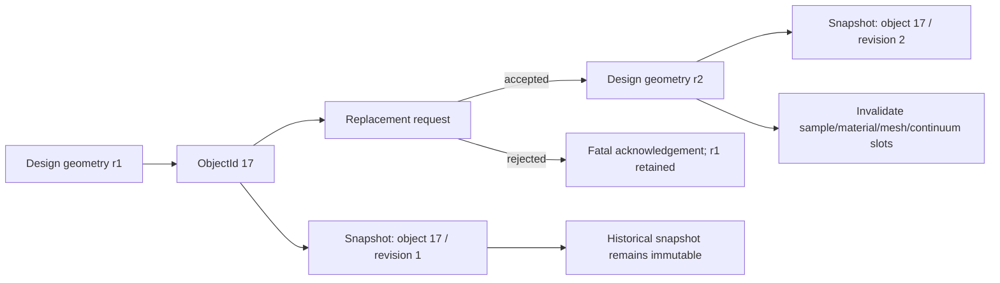
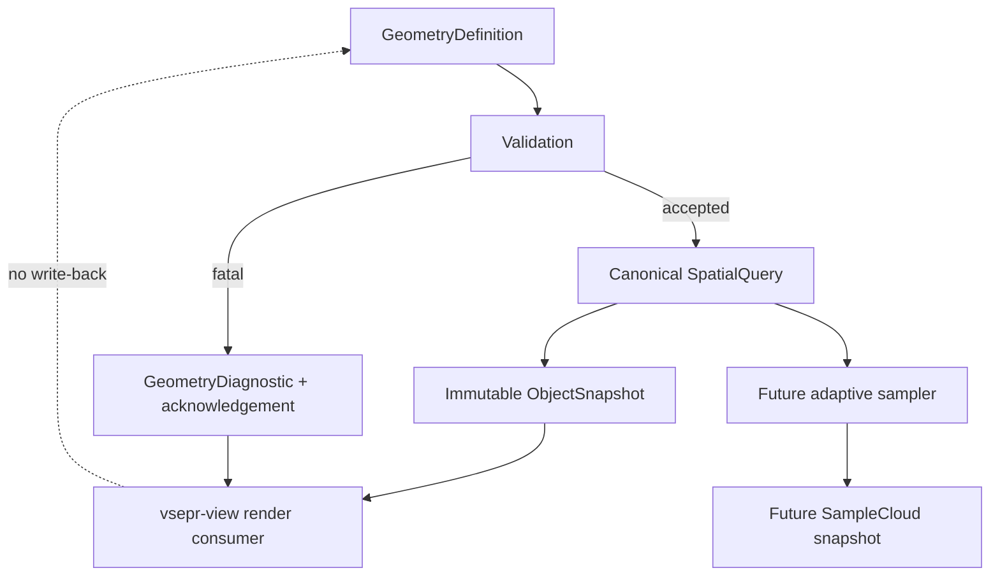

# WO-91 - Dynamic Object Geometry Bridge

## Identity

- Owner/context: ChronoDay 91 geometry-to-continuum foundation and closure.
- Day authority: `docs/day91/DAY91_OVERVIEW.tex`.
- Continuity map: `docs/post_day_tracking/DAY91_OVERVIEW.md`.
- Planning mirror: `plans/days/day_91.md` in the VSIM Coding Buddy workspace.
- Supported frontend: `vsepr-view`.
- Scope: canonical implicit geometry, dynamic-object identity and revisions,
  visible diagnostics, immutable snapshots, viewer acknowledgements, and the
  query contract required by future adaptive sampling.
- Scientific boundary: geometry is the only authoritative payload in this
  phase. Sampling, lower-scale evidence, material fields, meshes, and
  continuum states remain absent until their producing stages carry
  provenance.

## Status

[W] WO-91: geometry diagnostics, revision safety, and sampling handoff
[D] Day 91: B-U implemented or contract-frozen; A and V remain partial; W-Z reserved
[I] PARTIAL: code and verification gates pass; item-level TeX authority and final day close remain open
[V] PASS: expanded Group 91 plus both Group 89 regressions in normal and clean builds
[P] LOCAL: viewer/object source, tests, and ledgers updated; unrelated worktree changes untouched
[N] Review the T/U contracts before opening adaptive sampling; keep imported STL and Pd-H outside this work order

## Planning Boundary

Day letters and work-order labels are planning metadata. They must not become
runtime schema keys, public CLI names, core type names, or exported scientific
identifiers. Machine diagnostic codes are owned by the diagnostic registry,
not by day letters.

The earlier Phase 1 acceptance remains valid evidence. Expanding Day 91 does
not retroactively claim that diagnostics, transforms, nested CSG, viewer object
lifecycle handling, imported surfaces, or adaptive sampling already exist.

## Verified Phase 1 Boundary

- `GeometryDefinition` supports validated spheres, boxes, and ordered primitive
  CSG operations.
- `ImplicitGeometry` supplies signed distance, finite-difference normal, and
  conservative bounds queries.
- `ObjectWorld` owns objects behind stable, monotonic `ObjectId` values.
  Destroyed identifiers are not reused.
- Accepted design replacement creates a new design revision, clears all
  downstream product slots, and returns the object to `GeometryOnly`.
- `ObjectSnapshotPtr` is a `const`, by-value snapshot with no mutable alias to
  the live object.
- `SampleCloud`, `LowerScalePacket`, `MaterialField`, `VolumeMesh`,
  `ContinuumState`, and `SurfaceState` remain opaque and unpopulated.

## A-Z Work Register

| Letter | State | Work item | Completion gate |
|---|---|---|---|
| A | Partial | Baseline and authority freeze | Baseline evidence exists; add A's item-level TeX authority before completion |
| B | Complete | Human/machine diagnostic carrier | `GeometryDiagnostic` and `GeometryAcknowledgement` carry typed codes, severity, context, operation, state change, and stable comparison keys |
| C | Complete | Invalid primitive rejection | Invalid dimensions/non-finite values produce `GEO-E001`, no ID, and no state change |
| D | Complete | Transform convention and validation | Finite affine rigid/uniform-scale transforms are accepted; malformed, singular, non-uniform, and unannotated reflected transforms fail |
| E | Complete | Ordered and nested CSG behavior | Recursive compositions are deep-cloned; ordered evaluation survives snapshots |
| F | Complete | Empty CSG and invalid bounds | Disjoint intersection is `GEO-E003`; conservative empty risk is accepted with `GEO-W009`; invalid bounds retain `GEO-E005` |
| G | Complete | Normal validity | Zero gradients and CSG cusps return distinct explicit validity states |
| H | Complete | Object and revision identity | `GeometryRevision` is independently typed, monotonic, and included in acknowledgements |
| I | Complete | Stale identity and snapshot lifetime | `GEO-E006`/`GEO-E007` are visible while retained snapshots remain usable |
| J | Complete | Downstream invalidation and access guards | Replacement clears all derived slots; absent slots return `GEO-E008` |
| K | Complete | Live-viewer acknowledgement path | `vsepr-view` displays deduplicated state-change acknowledgements; missing artifacts emit `VIEW-E010` with no fallback load |
| L | Complete | Deterministic acknowledgement ledger | Semantic comparison keys exclude sequence/time and match across equivalent runs |
| M | Complete | Group 91 geometry regressions | Primitive, nested/ordered CSG, transform, empty-risk, bounds, and normal branches are covered |
| N | Complete | Group 91 lifecycle regressions | Revision, rollback, stale ID, retention, same-type, and mixed-object behavior are covered |
| O | Complete | Group 89 live-object regressions | The headless viewer feed covers replacement, destruction, retained snapshots, rejection, and state-change deduplication |
| P | Complete | Retired-path exclusion | The launcher accepts only `vsepr-view`; retired executable names are regression-rejected |
| Q | Complete | Build and memory-safety evidence | Normal, clean, and no-work builds pass; Clang analysis passes; unavailable sanitizer runtimes are recorded below |
| R | Complete | Geometry-state and revision diagrams | Diagrams distinguish live object state from immutable historical snapshots |
| S | Complete | Geometry query documentation | SDF, transforms, CSG, normal validity, snapshot lifetime, and invalidation are reproducible |
| T | Complete (contract) | Imported-surface adapter contract | Units, topology, hashes, transforms, diagnostics, and original/repaired forms are required; no importer is claimed |
| U | Complete (contract) | Adaptive-sampling handoff | Future samples preserve object ID, revision, frame, distance, normal validity, role, and provenance |
| V | Partial | Closure and Day 92 handoff | Evidence and exclusions are reconciled; final day close waits on A's item-level TeX authority |
| W | Reserved |  | Intentionally blank for late critical work |
| X | Reserved |  | Intentionally blank for cross-cutting correction |
| Y | Reserved |  | Intentionally blank for release/yield evidence |
| Z | Reserved |  | Intentionally blank for final close or emergency recovery |

W-Z remain blank unless the close ledger records a concrete reason to consume
reserved capacity.

## Diagnostic and Failure Contract

### Implemented Records

The implementation for B must provide one record type that is usable by the
core, tests, and viewer acknowledgement layer without importing viewer types:

```text
GeometryDiagnostic
  code
  severity: warning | fatal
  summary
  detail
  object_id: optional
  geometry_revision: optional
  operation
  state_changed

GeometryAcknowledgement
  sequence
  status
  operation
  object_id
  geometry_revision
  state_changed
  diagnostic: optional
  comparison_key
```

`comparison_key` is derived from semantic fields. Sequence, wall-clock time,
thread ID, and localized prose are excluded so equivalent operations can be
compared across runs.

### Implemented Code Registry

These names are emitted by the Day 91 implementation:

| Code | Severity | Meaning |
|---|---|---|
| `GEO-E001` | Fatal | Invalid primitive |
| `GEO-E002` | Fatal | Invalid transform |
| `GEO-E003` | Fatal | Confirmed empty CSG result |
| `GEO-W004` | Warning | Undefined or ambiguous normal |
| `GEO-E005` | Fatal | Invalid bounds |
| `GEO-E006` | Fatal | Stale snapshot where current revision is required |
| `GEO-E007` | Fatal | Stale or destroyed object ID |
| `GEO-E008` | Fatal | Unsupported or absent downstream slot access |
| `GEO-W009` | Warning | Possibly empty CSG result, not proven empty |
| `VIEW-E010` | Fatal | Viewer launch or accepted-snapshot publication failure |

Every fatal diagnostic prevents the requested state transition. A warning may
publish the accepted state only when the operation contract explicitly allows
it. The viewer displays diagnostics created at state-change boundaries; it
does not regenerate them each rendered frame.

### Acknowledgement States

```text
accepted
accepted_with_warning
rejected
stale
unsupported
```

No rejection may silently substitute the previous object, a default sphere,
an empty-but-valid scene, or another valid-looking representation. Retaining
the previous snapshot is allowed only when the acknowledgement explicitly says
the replacement was rejected and identifies the retained revision.

## Geometry Query Contract

### SDF Sign Convention

```text
signed_distance(point) < 0  -> point is inside
signed_distance(point) = 0  -> point is on the surface within query tolerance
signed_distance(point) > 0  -> point is outside
```

Tolerance belongs to the query/request record. It is not silently embedded as
a physical material constant.

### Ordered CSG

Composition is an ordered left fold:

```text
union(A, B)        = min(dA, dB)
intersection(A,B) = max(dA, dB)
subtract(A, B)     = max(dA, -dB)
```

For operations `seed, op1, op2, ...`, the result is:

```text
result = distance(seed)
result = apply(result, distance(op1))
result = apply(result, distance(op2))
...
```

Snapshots and audit records preserve this order. Reordering for rendering or
serialization is prohibited. `NestedComposition` supplies recursive operands;
accepted objects deep-clone the complete tree so later changes to an external
`shared_ptr` cannot mutate object truth.

### Transform Convention

The transform record uses an explicit `world_from_local` affine matrix:

- 4x4, column-major storage, matching the existing XBIT declaration;
- local geometry is queried by applying the validated inverse;
- units and coordinate-frame identity are required beside the matrix;
- the last row must represent an affine transform;
- all entries must be finite;
- the linear 3x3 block must be invertible;
- reflected orientation is rejected until an explicit orientation flag and
  tested normal handling exist;
- transformed bounds are recomputed conservatively in world coordinates.

Rigid and uniform-scale transforms are implemented. Non-uniform scale, shear,
singular matrices, incomplete frame/unit metadata, and unannotated reflection
are rejected before the object changes.

### Normal Validity

A normal query returns both a vector and a validity state:

```text
valid
undefined_zero_gradient
ambiguous_cusp
outside_tolerance
unsupported
```

A zero vector alone is insufficient because it cannot distinguish a valid
zero-like numerical result from an undefined direction. Normal validity is
preserved in samples and viewer overlays.

### Bounds

Bounds must be finite and axis ordered in the declared coordinate frame.
Invalid bounds are fatal. CSG subtraction retains the left-side conservative
bounds. Intersection may produce a confirmed empty bound. More complex cases
may produce `possibly_empty`; sampling or a stronger proof is required before
claiming emptiness.

## Object Identity and Revision Contract

`ObjectId` identifies the durable live object. `GeometryRevision` identifies a
specific accepted geometry definition owned by that object.



Rules:

- revision starts at the first accepted geometry;
- accepted replacement increments revision exactly once;
- failed replacement does not increment revision or mutate any payload;
- every snapshot names its source revision;
- destruction makes the live `ObjectId` stale;
- an already retained snapshot remains readable after destruction;
- a retained snapshot cannot satisfy an operation requiring the current live
  revision;
- object IDs are never reused within one `ObjectWorld` lifetime.

## Geometry State and Viewer Boundary



The renderer may expose object ID, geometry revision, stage, bounds, and
acknowledgement text. It cannot change geometry, create diagnostics in its hot
loop, infer missing physical fields, or publish renderer-owned state as
scientific truth.

## Downstream Invalidation Matrix

| Event | Geometry | Samples | Lower-scale packet | Material field | Mesh | Continuum | Surface |
|---|---|---|---|---|---|---|---|
| Accepted geometry replacement | New revision | Clear | Clear | Clear | Clear | Clear | Clear |
| Rejected replacement | Retain | Retain | Retain | Retain | Retain | Retain | Retain |
| Object destruction | Remove live object | Remove live attachments | Remove | Remove | Remove | Remove | Remove |
| Retained historical snapshot | Immutable copy | Snapshot flags only | Snapshot flags only | Snapshot flags only | Snapshot flags only | Snapshot flags only | Snapshot flags only |

Future payloads must carry the exact object and source revision they were
derived from. Attachment to a stale geometry revision fails visibly.

## Worked Examples

### Three-Sphere Composition

```text
seed: sphere(center = [-2, 0, 0], radius = 1)
union: sphere(center = [ 0, 0, 0], radius = 1)
union: sphere(center = [ 2, 0, 0], radius = 1)
subtract: sphere(center = [0, 0, 0], radius = 0.25)
```

Expected query behavior:

- centers at `x=-2` and `x=2` are inside;
- the subtraction center at `x=0` is outside;
- `x=0.5` remains inside;
- conservative x bounds remain `[-3, 3]`;
- the operation sequence is serialized exactly as declared.

### Replacement and Snapshot Retention

```text
create ObjectId 17 with sphere radius 1 -> geometry revision 1
retain snapshot S1                    -> object 17 / revision 1
replace with sphere radius 2          -> geometry revision 2
retain snapshot S2                    -> object 17 / revision 2
destroy ObjectId 17                   -> live lookup is stale
render S1 or S2                       -> allowed as historical snapshots
request current geometry for 17       -> GEO-E007
```

## Test and Regression Matrix

### Group 91 Geometry

- [x] Sphere distance and normal.
- [x] Box distance and boundary distance.
- [x] Ordered union.
- [x] Ordered intersection.
- [x] Ordered subtraction.
- [x] Stable, non-reused object ID.
- [x] Snapshot immutability.
- [x] Invalid primitive acknowledgement.
- [x] Invalid transform rejection.
- [x] Nested CSG.
- [x] Confirmed or possible empty CSG result.
- [x] Conservative CSG bounds for the existing composition.
- [x] Ambiguous normal validity.
- [x] Geometry revision increment.
- [x] Failed replacement rollback with diagnostic.
- [x] Stale-ID acknowledgement.
- [x] Snapshot retained after object destruction by ownership semantics.
- [x] Multiple same-type objects.
- [x] Multiple mixed-type objects.
- [x] Deterministic normalized query and acknowledgement output.

### Group 89 Live Viewer

- [x] Existing fixed-tick/live-density regression pair.
- [x] Replace an object through the persistent viewer acknowledgement feed.
- [x] Destroy an object through the persistent viewer acknowledgement feed.
- [x] Retain a snapshot after live-object mutation and destruction.
- [x] Assert no retired viewer path is invoked.
- [x] Show invalid-geometry and missing-artifact acknowledgements without fallback content.
- [x] Prove acknowledgement emission is state-change-driven by key deduplication.

### Build Verification

- [x] Configure `vis` preset.
- [x] Build the Phase 1 Group 91 target.
- [x] Run the Phase 1 Group 91 regression.
- [x] Build `vsepr-view` and both Group 89 targets.
- [x] Run Group 91 and Group 89 together.
- [x] Verify from a clean build directory.
- [x] Verify an immediate repeated build.
- [x] Run ASan/UBSan or the best supported equivalent; record unsupported
  toolchains as a real environment limitation.

## Evidence Log

- 2026-07-22: `cmake --preset vis` - exit 0.
- 2026-07-22:
  `cmake --build build_vis --target test_dynamic_object_phase1 --parallel 2`
  - exit 0.
- 2026-07-22:
  `ctest --test-dir build_vis --output-on-failure -R DynamicObjectPhase1Group91`
  - 1/1 passed.
- 2026-07-22:
  `cmake --build build_vis --target vsepr-view test_live_simulation_visuals test_live_simulation_thread --parallel 2`
  - exit 0.
- 2026-07-22:
  `ctest --test-dir build_vis --output-on-failure -R "(DynamicObjectPhase1Group91|LiveSimulationVisualsGroup89|LiveSimulationThreadGroup89)"`
  - 3/3 passed.
- 2026-07-24: Day 91 A-V closure scaffold added; W-Z left intentionally
  blank. This is documentation evidence, not new implementation evidence.
- 2026-07-24:
  `ctest --test-dir build_vis --output-on-failure -R "(DynamicObjectPhase1Group91|LiveSimulationVisualsGroup89|LiveSimulationThreadGroup89)"`
  - 3/3 passed in the current workspace.
- 2026-07-24: planning and source ledgers each contain the exact
  `ABCDEFGHIJKLMNOPQRSTUVWXYZ` sequence; W-Z have empty focus/output cells.
- 2026-07-24: `DAY91_OVERVIEW.tex` passed balanced-environment and
  balanced-brace checks. PDF compilation was not run because `pdflatex`,
  `xelatex`, `lualatex`, and `tectonic` are unavailable locally.
- 2026-07-24: expanded `DynamicObjectPhase1Group91` to eight contract
  functions covering primitive and nested CSG queries, transforms, empty
  results/warnings, atomic replacement, stale access, retained snapshots,
  mixed objects, downstream guards, and deterministic acknowledgements.
- 2026-07-24:
  `cmake --build --preset vis --target vsepr-view vsepr_cli test_live_simulation_visuals test_dynamic_object_phase1 test_live_simulation_thread`
  - exit 0.
- 2026-07-24: immediate repetition of the same build reported
  `ninja: no work to do`.
- 2026-07-24:
  `ctest --test-dir build_vis -R "(DynamicObjectPhase1Group91|LiveSimulationVisualsGroup89|LiveSimulationThreadGroup89)" --output-on-failure`
  - 3/3 passed after final contract hardening.
- 2026-07-24: clean configure in `build_day91_clean`, focused build of the
  viewer, launcher library, and all three regression targets - exit 0.
- 2026-07-24: the first clean test exposed tick-rate reporting that included
  bootstrap/paused wall time. The rate window was corrected to count active
  simulation time only; `LiveSimulationThreadGroup89` then passed 10
  consecutive runs.
- 2026-07-24:
  `ctest --test-dir build_day91_clean -R "(DynamicObjectPhase1Group91|LiveSimulationVisualsGroup89|LiveSimulationThreadGroup89)" --output-on-failure`
  - 3/3 passed.
- 2026-07-24: GCC ASan/UBSan configure could not link because `libasan` and
  `libubsan` are not installed. Clang ASan configure also could not link its
  Windows runtime. `clang++ --analyze` completed with exit 0 for
  `src/multiscale/dynamic_object.cpp` and
  `tests/test_dynamic_object_phase1.cpp`.

## Legacy STL Collection

No actual STL reader or triangle-surface importer exists to promote.

Reusable migration evidence:

- `GeometryMeshEntry` in `include/vsim/vsim_document.hpp` supplies mesh `id`,
  `file`, and `role` declarations.
- `GeometryObject::mesh_file` and its parser support in
  `src/vsim/vsim_parser.cpp` preserve a VSIM-level file reference.
- `scripts/audits/audit_xbit_xyz_stl_binding.vsim` defines object-ID,
  transform, checksum, missing-reference, and invalid-transform audit intent.

Excluded legacy code:

- the retired `FEAVisualizer` reads only VTK/OBJ vertex positions and does not
  preserve triangle topology;
- `gl_application.hpp` declares a mesh loader without an STL implementation;
- archived viewer code cannot become an importer dependency or active fallback.

## Future Imported-Surface Record

The T contract requires:

```text
ImportedSurfaceRecord
  object_id
  geometry_revision
  format
  source_path
  declared_units
  coordinate_frame
  world_from_local
  source_hash
  normalized_hash
  vertices
  triangle_topology
  watertight_status
  manifold_status
  orientation_status
  diagnostics
  original_form_ref
  repaired_form_ref: optional
  provenance
```

Original and repaired forms are separate records. Repair never overwrites
source truth. Import must either expose a valid surface query or produce a
declared conversion to an implicit representation.

## Future Adaptive-Sampling Query

The U contract requires:

```text
SpatialSample
  object_id
  geometry_revision
  sample_id
  coordinate_frame
  position
  signed_distance
  normal
  normal_validity
  role: exterior | interior | surface_crossing | interface | ambiguous
  source_cell_id
  refinement_level
  query_tolerance
  provenance
```

The first sampler:

1. creates one root cell from canonical geometry bounds;
2. classifies corners and center with the same query tolerance;
3. refines surface-crossing and ambiguous cells;
4. adds curvature-sensitive refinement only after deterministic baseline
   behavior exists;
5. emits surface/interior samples with object and revision identity;
6. publishes an immutable sample-cloud snapshot;
7. allows the viewer to display samples without making them geometry truth.

## MolecularDB Background Constraint

MolecularDB remains the durable memory substrate for molecular studies, not a
geometry-object store.

- One canonical molecule identity owns one lazily created durable directory.
- Formula is a study namespace/search key, not a unique molecule identity.
- A Day 91 object may be referenced by a molecular study only when a real
  observation, run, or proposal exists.
- The append-only reference carries molecule identity, `ObjectId`, geometry
  revision, artifact hash, coordinate frame, method, and acknowledgement.
- Geometry replacement or destruction never rewrites historical MolecularDB
  evidence.
- No installer-created empty molecule tree, duplicate formula ownership,
  reward write, candidate promotion, or best-property update belongs to Day 91.

## Explicit Non-Goals

WO-91 does not implement:

- STL or STEP parsing;
- triangle repair;
- adaptive octree sampling or sample visualization;
- `.xyz`, `.xyzFull`, XBIT, or `.dynx` generation;
- molecular formation;
- VSEPR-derived material properties;
- density assignment;
- constitutive models;
- tetrahedral meshing or integration-point mapping;
- FEA assembly, solving, remeshing, or state transfer;
- MolecularDB writers, reward loops, or property promotion;
- Q#, Q+, or ChemPlus language/runtime expansion;
- scientific validation of any continuum response;
- Pd-H fitting.

Opaque downstream type slots may exist, but no placeholder result is treated
as scientific state.

## Closure Acceptance

### Verified Baseline

- [x] Sphere and box SDF definitions produce expected signs and normals.
- [x] Ordered union, intersection, and subtraction use canonical SDF rules.
- [x] Object IDs are stable and destroyed IDs are not reused.
- [x] Snapshots remain unchanged after later edits.
- [x] Replacing design geometry clears future derived representations.
- [x] No material constants, element tables, FEA values, MolecularDB values,
  or Pd-H fitting data enter the geometry foundation.
- [x] Baseline Group 91 and Group 89 verification passes.

### Required to Close Day 91

- [x] Invalid geometry and transform inputs fail visibly.
- [x] Geometry revisions are independently typed and included in diagnostics.
- [x] Snapshot revisions identify their source geometry revision.
- [x] CSG operation order survives snapshots and acknowledgement audits.
- [x] Empty/possibly-empty CSG and invalid bounds are distinguished.
- [x] Downstream invalidation and stale access are tested.
- [x] Viewer diagnostics expose accepted snapshot object ID, revision, stage,
  bounds, and state-change acknowledgement.
- [x] The viewer never substitutes valid-looking content after failure.
- [x] Retired viewer code remains excluded.
- [x] Imported-surface and adaptive-sampling contracts are reviewable without
  claiming either implementation.
- [x] Exact clean/repeated build and supported memory-safety evidence is stored.
- [x] W-Z remain blank or their use is justified in the close ledger.

Final administrative close remains blocked only by A's item-level TeX
authority requirement; this implementation pass does not manufacture that
artifact.

## Carry Forward

Immediate post-Day-91 implementation order:

1. Add A's item-level TeX authority and reconcile V for administrative close.
2. Review T-U, then begin adaptive octree sampling as the next source phase.
3. Add imported STL ingestion independently from archived viewers only after
   the imported-surface contract is accepted.
4. Attach lower-scale packets only when a calculation names source artifact,
   method, units, conditions, uncertainty state, object ID, and revision.
5. Introduce material fields, octree-derived tetrahedra, and continuum state in
   separate later work orders with their own scientific validation.
